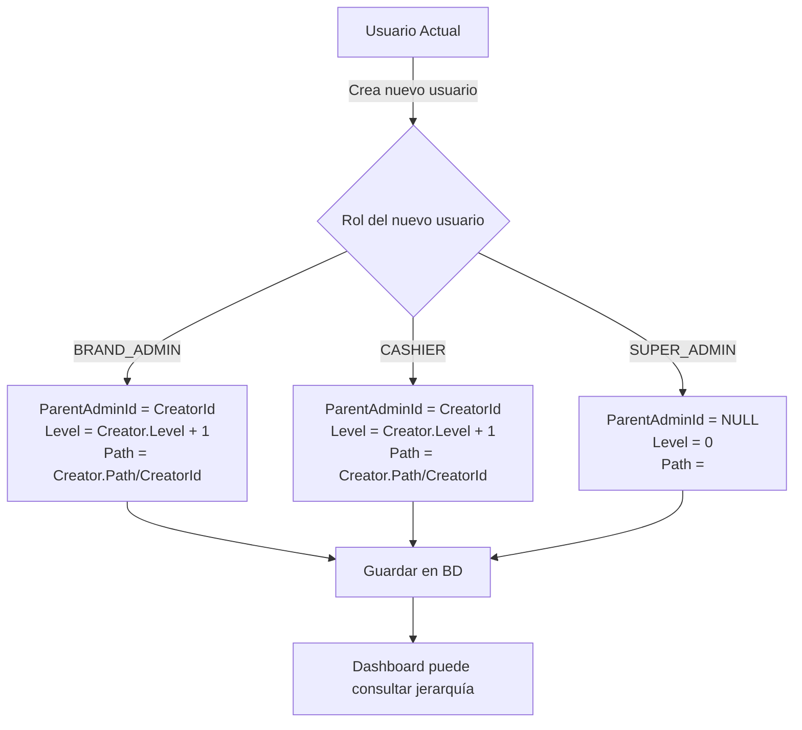

# ?? Fix: Jerarquía Automática en Creación de Usuarios

## ?? **Problema Corregido**

El `BackofficeUserService` **no establecía correctamente** los campos de jerarquía al crear nuevos usuarios:
- ? `ParentAdminId` siempre quedaba en `NULL`
- ? `HierarchyLevel` siempre quedaba en `0`
- ? `HierarchyPath` siempre quedaba vacío

Esto provocaba que:
1. El dashboard no pudiera calcular el árbol jerárquico
2. Todos los usuarios aparecían al mismo nivel
3. Las comisiones no se calculaban correctamente
4. Los reportes no mostraban datos de subordinados

---

## ? **Solución Implementada**

### **Cambios en `BackofficeUserService.cs`**

#### 1. **Establecer jerarquía al crear usuario** (línea ~132)

**ANTES**:
```csharp
var newUser = new BackofficeUser
{
    Id = Guid.NewGuid(),
    Username = request.Username,
 PasswordHash = passwordHash,
    Role = request.Role,
    BrandId = assignedBrandId,
    ParentCashierId = request.ParentCashierId,
    CommissionPercent = request.Role == BackofficeUserRole.CASHIER ? request.CommissionRate : 0,
    Status = BackofficeUserStatus.ACTIVE,
 CreatedAt = DateTime.UtcNow,
    CreatedByUserId = currentUserId,
    CreatedByRole = currentUser.Role.ToString()
 // ? ParentAdminId no se establece
    // ? HierarchyLevel no se establece
    // ? HierarchyPath no se establece
};
```

**AHORA**:
```csharp
var newUser = new BackofficeUser
{
    Id = Guid.NewGuid(),
    Username = request.Username,
    PasswordHash = passwordHash,
    Role = request.Role,
    BrandId = assignedBrandId,
    ParentCashierId = request.ParentCashierId,
    CommissionPercent = request.Role == BackofficeUserRole.CASHIER ? request.CommissionRate : 0,
    Status = BackofficeUserStatus.ACTIVE,
    CreatedAt = DateTime.UtcNow,
    CreatedByUserId = currentUserId,
    CreatedByRole = currentUser.Role.ToString(),
    // ? FIX: Establecer jerarquía correctamente
    ParentAdminId = await DetermineParentAdminIdAsync(request.Role, currentUserId, currentUser.Role),
    HierarchyLevel = await CalculateHierarchyLevelAsync(request.Role, currentUserId, currentUser.Role),
    HierarchyPath = await BuildHierarchyPathAsync(request.Role, currentUserId, currentUser.Role)
};
```

#### 2. **Método `DetermineParentAdminIdAsync`**

```csharp
/// <summary>
/// FIX: Determina el ParentAdminId según el rol del usuario creador
/// </summary>
private async Task<Guid?> DetermineParentAdminIdAsync(
    BackofficeUserRole newUserRole,
    Guid creatorUserId,
    BackofficeUserRole creatorRole)
{
    // SUPER_ADMIN no tiene parent
    if (newUserRole == BackofficeUserRole.SUPER_ADMIN)
  {
        return null;
    }

    // BRAND_ADMIN es creado por SUPER_ADMIN, su parent es el SUPER_ADMIN
  if (newUserRole == BackofficeUserRole.BRAND_ADMIN)
    {
        if (creatorRole == BackofficeUserRole.SUPER_ADMIN)
     {
   return creatorUserId;
  }
        return null;
    }

    // CASHIER es creado por BRAND_ADMIN o por otro CASHIER
    if (newUserRole == BackofficeUserRole.CASHIER)
    {
        if (creatorRole == BackofficeUserRole.BRAND_ADMIN)
        {
            return creatorUserId;
        }
        else if (creatorRole == BackofficeUserRole.CASHIER)
   {
      return creatorUserId;
        }
    }

    return null;
}
```

#### 3. **Método `CalculateHierarchyLevelAsync`**

```csharp
/// <summary>
/// FIX: Calcula el HierarchyLevel según el rol y el creador
/// </summary>
private async Task<int> CalculateHierarchyLevelAsync(
    BackofficeUserRole newUserRole,
  Guid creatorUserId,
    BackofficeUserRole creatorRole)
{
    // SUPER_ADMIN siempre es nivel 0
    if (newUserRole == BackofficeUserRole.SUPER_ADMIN)
    {
    return 0;
    }

    // Obtener el nivel del creador
    var creator = await _context.BackofficeUsers
        .FirstOrDefaultAsync(u => u.Id == creatorUserId);

    if (creator == null)
    {
     // Fallback: asignar nivel por rol
      return newUserRole switch
        {
       BackofficeUserRole.BRAND_ADMIN => 1,
          BackofficeUserRole.CASHIER => 2,
      _ => 0
      };
    }

    // El nuevo usuario está un nivel debajo del creador
    return creator.HierarchyLevel + 1;
}
```

#### 4. **Método `BuildHierarchyPathAsync`**

```csharp
/// <summary>
/// FIX: Construye el HierarchyPath incluyendo al creador
/// </summary>
private async Task<string> BuildHierarchyPathAsync(
    BackofficeUserRole newUserRole,
    Guid creatorUserId,
    BackofficeUserRole creatorRole)
{
    // SUPER_ADMIN tiene path vacío
    if (newUserRole == BackofficeUserRole.SUPER_ADMIN)
    {
        return "";
    }

    // Obtener el creador
    var creator = await _context.BackofficeUsers
   .FirstOrDefaultAsync(u => u.Id == creatorUserId);

    if (creator == null)
    {
        return creatorUserId.ToString();
    }

    // Construir path: path_del_creador + "/" + id_del_creador
    if (string.IsNullOrEmpty(creator.HierarchyPath))
 {
        return creatorUserId.ToString();
    }

    return $"{creator.HierarchyPath}/{creatorUserId}";
}
```

---

## ?? **Jerarquía Resultante**

### **Ejemplo de Creación**

```csharp
// 1. superadmin crea localadmin
superadmin (Level 0, ParentAdminId: NULL, Path: "")
  ?? localadmin (Level 1, ParentAdminId: superadmin, Path: "superadmin-id")

// 2. localadmin crea localcajero
superadmin (Level 0)
  ?? localadmin (Level 1)
      ?? localcajero (Level 2, ParentAdminId: localadmin, Path: "superadmin-id/localadmin-id")

// 3. localcajero crea localcajero2
superadmin (Level 0)
  ?? localadmin (Level 1)
?? localcajero (Level 2)
          ?? localcajero2 (Level 3, ParentAdminId: localcajero, Path: "superadmin-id/localadmin-id/localcajero-id")
```

---

## ? **Validación**

### **Prueba del Fix**

1. **Crear un nuevo usuario**:
```sh
curl -X POST "http://localhost:7182/api/v1/admin/users" \
  -H "Cookie: bk.token.localhost_dev=TOKEN" \
  -H "Content-Type: application/json" \
  -d '{
    "username": "testcajero",
    "password": "password",
    "role": "CASHIER",
    "commissionPercent": 15
  }'
```

2. **Verificar jerarquía** con diagnóstico:
```sh
curl -X GET "http://localhost:7182/api/v1/admin/diagnostics/system-status" \
  -H "Cookie: bk.token.localhost_dev=TOKEN"
```

**Valores esperados**:
```json
{
  "id": "new-user-id",
  "username": "testcajero",
  "role": "CASHIER",
  "parentAdminId": "current-user-id",  // ? Debe tener valor
  "hierarchyLevel": 3,   // ? Debe ser N+1 del creador
  "hierarchyPath": "superadmin-id/localadmin-id/localcajero-id" // ? Debe incluir al creador
}
```

---

## ?? **Impacto del Fix**

### **Antes del Fix**
```
? Todos los usuarios con HierarchyLevel = 0
? ParentAdminId = NULL para todos
? Dashboard muestra datos en 0
? No se pueden calcular comisiones
? Scope TREE no funciona
```

### **Después del Fix**
```
? Jerarquía correcta automáticamente
? ParentAdminId establecido según creador
? Dashboard muestra datos correctos
? Comisiones se calculan correctamente
? Scope TREE funciona como esperado
```

---

## ?? **Datos Históricos**

### **Para usuarios existentes**

Los usuarios creados **antes** de este fix siguen teniendo jerarquía rota. Para corregirlos:

1. **Opción A**: Ejecutar script SQL manual:
```sql
-- Usar scripts/fix-localhost-hierarchy.sql
```

2. **Opción B**: Usar endpoint de reset:
```sh
curl -X POST "http://localhost:7182/api/v1/admin/diagnostics/reset-and-initialize" \
  -H "Cookie: bk.token.localhost_dev=TOKEN"
```

3. **Opción C**: Crear un endpoint de migración automática (recomendado para producción):
```csharp
// TODO: Implementar endpoint POST /api/v1/admin/diagnostics/fix-hierarchy
// Que recorra todos los usuarios y establezca jerarquía basándose en CreatedByUserId
```

---

## ?? **Flujo de Creación Correcto**



---

## ? **Checklist de Validación**

- [x] `BackofficeUserService.CreateUserAsync` modificado
- [x] Método `DetermineParentAdminIdAsync` agregado
- [x] Método `CalculateHierarchyLevelAsync` agregado
- [x] Método `BuildHierarchyPathAsync` agregado
- [x] Compilación exitosa
- [ ] Pruebas con nuevos usuarios
- [ ] Verificar dashboard con nuevos datos
- [ ] Migrar usuarios históricos (opcional)

---

**Archivo**: `apps/Casino.Application/Services/Implementations/BackofficeUserService.cs`  
**Líneas modificadas**: 132-138, 233-322  
**Fecha**: 2025-01-22  
**Versión**: 1.0
